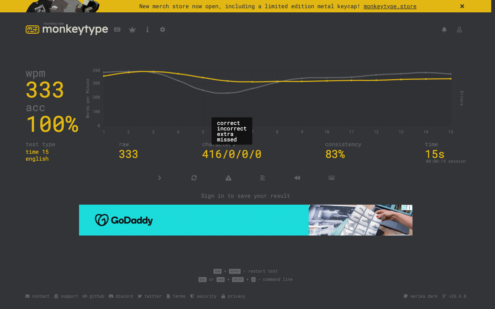
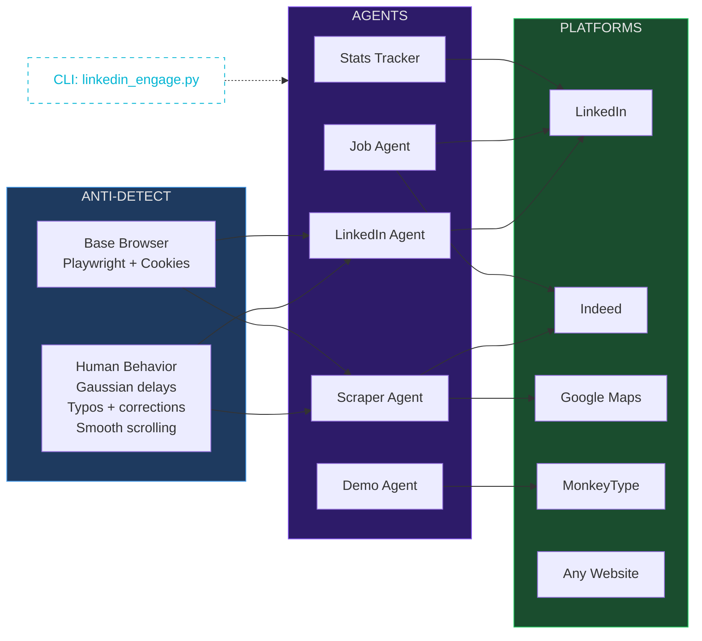

<div align="center">

# Ghost Browser

### The browser moves on its own. No human needed.


Your browser opens. Types by itself. Scrolls LinkedIn. Posts content. Applies to jobs.
Scrapes data from any website. Takes typing tests at **412 WPM**. All while you watch.

**Built in one session with Claude Code + Playwright.**

<br />


<br />

[View Demo](#the-wow-demo) · [Quick Start](#quick-start) · [All Commands](#all-commands) · [How It Works](#how-it-works)

</div>

---

## What It Does

| Capability | What Happens |
|:---|:---|
| **LinkedIn Auto-Post** | Opens LinkedIn, types your post letter-by-letter, attaches image, clicks Post |
| **LinkedIn Engagement** | Scrolls feed, likes posts, writes AI-generated comments in your voice |
| **Job Applications** | Searches jobs, reads descriptions, applies with AI-written cover letters |
| **Universal Web Scraper** | Scrapes ANY website — Indeed, Google Maps, Hacker News, anything |
| **Ghost Typing** | Takes typing tests at 400+ WPM with 100% accuracy |
| **Speed Reading** | Opens Wikipedia, scrolls and highlights key information live |
| **GitHub Trending** | Browses trending repos, opens top projects |
| **Stats Tracking** | Pulls followers/views from LinkedIn, Twitter, YouTube |
| **Screenshot Tool** | Screenshots any URL with custom viewports |

---

## The WOW Demo

```bash
python3 demo_wow.py
```

Watch the browser come alive — 6 stages, zero human input:

1. **Google Search** — ghost types "How to build AI agents" letter by letter
2. **Wikipedia** — speed-reads an AI article, highlights key paragraphs
3. **GitHub** — browses trending repos, clicks into the #1 project
4. **MonkeyType** — takes a typing test at ~400 WPM (world record is 300)
5. **Hacker News** — reads the top tech story
6. **Finale** — custom branded splash screen

**No one is touching the keyboard. The browser does everything.**

---

## Proof It Works

### MonkeyType — 412 WPM | 100% Accuracy

<div align="center">


</div>

> MonkeyType flagged it as **"Test invalid"** because no human can type this fast. The world record is ~300 WPM. Ghost Browser hit 412.

<br />

### MonkeyType — Live Demo | 333 WPM | 100% Accuracy

<div align="center">



</div>

> **Live run (March 2026):** 333 WPM, 416 characters typed in 15 seconds, 100% accuracy, 83% consistency. Every single character typed by the bot in real-time — no human touched the keyboard.

<br />

### LinkedIn — Live Feed Scrape

```
[1] Henryk Brzozowski — Voice AI Expert
    "Most people in the Voice AI space start with cold outreach..."

[2] Raj Shamani — Founder & Host @ Figuring Out
    "Suniel Shetty almost left his acting career to sell idlis..."

[3] Aditya Sharma — Helping Top 1% AI Talent
    "Most people confuse these 4 AI terms..."

[4] Fatmir Hyseni — Chartered Marketer
    "SEO built Canva. LLMs are now sending them double-digit % of traffic..."
```

> **Live run (March 2026):** Bot opened LinkedIn, scrolled the feed with human-like behavior, and extracted 5 real posts — authors, headlines, content — all hands-free.

<br />

### LinkedIn — Auto-Posted With Image

<div align="center">


</div>

> Full post with image, typed and published automatically. "Post successful" confirmation at the bottom — completely hands-free.

---

## Architecture



---

## Quick Start

```bash
# Clone
git clone https://github.com/aiagentwithdhruv/ghost-browser.git
cd ghost-browser

# Install
pip install -r requirements.txt
playwright install chromium

# Set up credentials
cp .env.example .env
# Add your LinkedIn li_at cookie (see Credentials section)

# Run the demo
python3 demo_wow.py
```

**4 commands. Watch the magic.**

---

## All Commands

### LinkedIn Automation

```bash
# Post to LinkedIn with image
python3 linkedin_engage.py post --text "Your post here" --image photo.jpg --visible

# Post from a text file
python3 linkedin_engage.py post --text-file post.txt --image banner.png --visible

# Scroll feed and view posts
python3 linkedin_engage.py feed --visible

# Auto-engage: like + AI comment on 5 posts
python3 linkedin_engage.py engage --count 5 --visible

# Search + apply to jobs with AI cover letters
python3 linkedin_engage.py apply --query "AI engineer" --location "Remote" --visible

# Send connection requests with custom note
python3 linkedin_engage.py connect --profile "https://linkedin.com/in/someone" --note "Hey!" --visible
```

### Scrape Any Website

```bash
# Indeed jobs
python3 universal_scraper.py indeed --query "AI engineer" --output jobs.json

# Google Maps businesses
python3 universal_scraper.py google-maps --query "AI companies San Francisco" --output leads.json

# Any URL — smart mode auto-detects content
python3 universal_scraper.py "https://news.ycombinator.com" --mode smart --output hn.json

# Custom CSS selector
python3 universal_scraper.py "https://example.com" --selector "h2.title" --output titles.json
```

### Stats & Screenshots

```bash
# Pull stats from all platforms
python3 stats_tracker.py --notify

# YouTube only (free API, no browser needed)
python3 stats_tracker.py --youtube-only

# Screenshot any URL
python3 screenshot_tool.py --url "https://example.com" --output screenshot.png
```

### Fun Demos

```bash
# The full WOW demo (6 stages)
python3 demo_wow.py

# MonkeyType speed demon (15 sec test, ~400 WPM)
python3 monkeytype_flex.py

# Job market research (LinkedIn + Indeed)
python3 job_research.py
```

---

## How It Works

### Human-Like Behavior Engine

The `human_behavior.py` layer makes every action indistinguishable from a real user:

| Behavior | Implementation |
|:---|:---|
| **Typing** | Character-by-character at 40-55 WPM with 3-5% typo rate — types wrong char, pauses, backspaces, corrects |
| **Delays** | Gaussian distribution (not uniform) — clusters around midpoint like real humans |
| **Scrolling** | Sinusoidal speed curve — slow start, fast middle, slow end |
| **Clicking** | Random offset from element center (bots click dead-center, humans don't) |
| **Reading** | Calculates reading time based on word count, waits proportionally |
| **Breaks** | 30-120 sec breaks every 15-25 actions |
| **Viewport** | Random realistic resolution from a pool (1440x900, 1920x1080, etc.) |

```python
# Ghost typing with realistic typos
HumanBehavior.human_type(page, "input", "Hello world", wpm=45, typo_rate=0.05)

# Smooth scrolling (sinusoidal, not instant jump)
HumanBehavior.human_scroll(page, "down", distance=600)

# Click with natural offset from center
HumanBehavior.human_click(page, "button.submit")

# Reading delay proportional to content length
HumanBehavior.reading_time("This is a long article about AI...")
```

### LinkedIn Post Flow

```
Open feed → Click "Start a post"
    → Find Quill editor (contenteditable div)
    → Short posts (<200 chars): ghost-type character-by-character with typos
    → Long posts (>200 chars): insert_text (humans paste long posts too)
    → Click media button → upload image via file input
    → Click "Next" (LinkedIn's image editor step)
    → Click "Post" → confirmed!
```

### AI-Generated Comments

```python
# Uses GPT-4o-mini with your brand voice
BRAND_PROMPT = """You are Dhruv Tomar (AIwithDhruv), an Applied AI Engineer.
Your tone: 40% witty realism, 30% strategic clarity, 20% motivational.
Write SHORT comments (1-3 sentences). Be genuine, add value.
Never be generic ("Great post!"). Sound like a real person."""
```

---

## Getting Credentials

<details>
<summary><b>LinkedIn <code>li_at</code> Cookie</b></summary>

1. Login to LinkedIn in Chrome
2. DevTools (F12) → Application → Cookies → `linkedin.com`
3. Copy `li_at` value → paste in `.env`

</details>

<details>
<summary><b>YouTube API Key (FREE)</b></summary>

1. [Google Cloud Console](https://console.cloud.google.com/apis/credentials) → Enable YouTube Data API v3
2. Create API Key → copy to `.env`
3. Cost: $0 (10,000 free units/day)

</details>

<details>
<summary><b>Twitter Cookies</b></summary>

1. Login to x.com → DevTools → Application → Cookies
2. Copy `auth_token` and `ct0` → paste in `.env`

</details>

---

## v2.0 — Multi-Agent Orchestrator

**NEW in v2.0:** Run multiple browser agents simultaneously, each in its own isolated context.

```bash
# Run 3 agents at once (MonkeyType + GitHub + Hacker News)
python3 orchestrator.py --demo --visible

# LinkedIn feed + Indeed jobs + Google Maps scraping
python3 orchestrator.py --combo lead-gen --visible

# Custom agent mix
python3 orchestrator.py --agents linkedin-engage,indeed,github --visible

# List all agents and combos
python3 orchestrator.py --list
```

### Available Agents

| Agent | What It Does |
|:---|:---|
| `linkedin-feed` | Scroll LinkedIn feed, extract posts |
| `linkedin-engage` | Like AI-related posts with human behavior |
| `indeed` | Scrape Indeed job listings |
| `gmaps` | Scrape Google Maps businesses |
| `monkeytype` | Speed typing demo (~400 WPM) |
| `github` | Browse GitHub trending repos |
| `hackernews` | Read top Hacker News stories |

### Pre-built Combos

| Combo | Agents |
|:---|:---|
| `demo` | monkeytype, github, hackernews |
| `research` | linkedin-feed, indeed, github |
| `lead-gen` | linkedin-feed, gmaps, indeed |
| `full` | linkedin-engage, indeed, gmaps, github, hackernews |

### How It Works

Each agent runs in its own **isolated Playwright BrowserContext** — separate cookies, localStorage, viewport, and session. One Chrome process, multiple independent agents. The audience sees multiple browser windows open at once, each doing its own thing.

---

## v2.0 — MCP Server

Turn Ghost Browser into an **MCP server** so any AI agent can control it:

```json
{
    "mcpServers": {
        "ghost-browser": {
            "command": "python3",
            "args": ["/path/to/ghost_mcp.py"],
            "env": {
                "LINKEDIN_LI_AT": "your_cookie_here",
                "OPENAI_API_KEY": "sk-..."
            }
        }
    }
}
```

### MCP Tools Exposed

| Tool | What It Does |
|:---|:---|
| `linkedin_feed` | Get LinkedIn feed posts |
| `linkedin_post` | Create a LinkedIn post |
| `linkedin_engage` | Like posts with human behavior |
| `scrape_url` | Scrape any website |
| `scrape_indeed` | Scrape Indeed jobs |
| `scrape_gmaps` | Scrape Google Maps businesses |
| `typing_demo` | Run MonkeyType speed test |
| `screenshot` | Screenshot any URL |
| `multi_run` | Run multiple agents in parallel |

Works with **Claude Code, Claude Desktop, Cursor, Codex** — any MCP client.

---

## Project Structure

```
ghost-browser/
├── orchestrator.py           Multi-agent orchestrator (7 agents, 4 combos)
├── multi_context.py          Isolated browser session manager
├── ghost_mcp.py              MCP server (9 tools for any AI agent)
│
├── base_browser.py           Playwright base class (context manager)
├── human_behavior.py         Anti-detection engine (v2: mouse drift, idle, warmup)
│
├── linkedin_browser.py       LinkedIn read + write operations
├── linkedin_engage.py        LinkedIn CLI (feed, post, engage, apply, connect)
├── linkedin_scraper.py       LinkedIn stats scraper
│
├── universal_scraper.py      Scrape any website (6 presets)
├── twitter_scraper.py        Twitter/X scraper
├── youtube_stats.py          YouTube API (no browser)
│
├── screenshot_tool.py        Universal screenshot tool
├── stats_tracker.py          Master stats + Telegram notifications
│
├── demo_wow.py               The viral demo (6 stages)
├── monkeytype_flex.py        Speed typing demo (400+ WPM)
├── job_research.py           Job market research
│
├── results/                  Orchestrator run outputs (JSON)
├── assets/                   Screenshots
├── requirements.txt          Dependencies
└── .env.example              Credential template
```

---

## Tech Stack

| Tool | Purpose |
|:---|:---|
| **Playwright** | Headless/visible Chrome automation |
| **Python 3** | Clean scripts, no heavy frameworks |
| **OpenAI GPT-4o** | AI-generated comments and cover letters |
| **YouTube Data API** | Free stats without browser overhead |

---

## Use Cases

| Use Case | How | Potential Revenue |
|:---|:---|:---|
| **LinkedIn Automation Service** | Auto-post, engage, grow profiles for clients | $500-2,000/mo per client |
| **Web Scraping Gigs** | Scrape leads, jobs, businesses on Fiverr/Upwork | $200-1,000 per project |
| **LinkedIn Ghostwriting** | AI-write + auto-post for founders/CEOs | $500-1,500/mo per client |
| **Job Application Bot** | Auto-apply to 100+ jobs for seekers | $50-200 per person |
| **Lead Generation** | Scrape Google Maps → enrich → cold email | $500-2,000/mo per client |

---

## How This Was Built — The Raw AI Prompts

This entire toolkit — 15 files, 3,000+ lines, LinkedIn automation, web scraping, human behavior engine, typing demos — was built in **one session** using [Claude Code](https://claude.ai/code). No boilerplate. No tutorials. Just natural language prompts.

Here are the exact prompts used, in order:

### Prompt 1: Build the Foundation

> *"Build browser automation also so we can use whenever needed."*

**What happened:** Claude Code read the existing `skool-monitor` Playwright scripts for patterns, then generated the full foundation — `base_browser.py` (context manager with cookie auth), `linkedin_scraper.py`, `twitter_scraper.py`, `youtube_stats.py`, `screenshot_tool.py`, `stats_tracker.py`. Installed Playwright + Chromium, tested all imports, took a test screenshot of example.com.

**Result:** 8 files, working LinkedIn scraper (pulled 5,750 followers, 432 connections), YouTube API integration.

---

### Prompt 2: Test It Live

> *"Great now can we test with browser, check my LinkedIn."*

**What happened:** First run failed — `LINKEDIN_LI_AT` not set. Claude guided me through DevTools to extract the `li_at` cookie. Second run hit a bug: `BaseBrowser.evaluate() takes 2 positional arguments but 3 were given`. Claude fixed it by adding `arg=None` parameter. Third run worked perfectly.

**Result:** Live LinkedIn data — followers, connections, 5 recent posts with analytics. Bug found and fixed in real-time.

---

### Prompt 3: Make It Human

> *"Great now can you add more functionality like checking comments, replying, applying to jobs — but like a human, not like a machine."*

**What happened:** Claude asked two clarifying questions (job apply scope: "Both Easy Apply + External", comment style: "AI-generated"). Then built 4 new files:
- `human_behavior.py` — Gaussian delays, character-by-character typing with typos and backspace corrections, sinusoidal scrolling, random viewport, session breaks
- `linkedin_browser.py` — Full LinkedInBrowser class with engagement methods
- `linkedin_engage.py` — CLI with feed, comments, engage, apply, connect commands

**Result:** Human-like automation that types with typos, scrolls naturally, takes reading breaks. Tested: feed scraping (5 posts), comments check — all working.

---

### Prompt 4: Universal Scraper

> *"Great, can you create those kind of Yellow Pages, Google, and others where it can scrape everything — or same will work everywhere?"*

**What happened:** Claude built `universal_scraper.py` with 3 modes (smart/full/selector) and 6 directory presets. Tested on Indeed (32 jobs scraped), Google Maps (11 businesses), Hacker News (smart mode auto-detected stories).

**Result:** One script that scrapes ANY website. Presets for Indeed, Google Maps, Yellow Pages, JustDial, IndiaMART, Yelp.

---

### Prompt 5: LinkedIn Post with Image

> *"How can I add image?"* (for LinkedIn posting)
>
> Then: *(shared full post content about Conversa AI + app screenshot)*
>
> *"Yes, in Downloads — the recent one."*

**What happened:** Claude added `create_post()` method with image upload support. First attempt failed — LinkedIn shows "Next" button after image upload (image editor step) before showing "Post". Claude debugged with screenshots, found the issue, fixed the flow: type content → attach image → click Next → click Post.

**Result:** LinkedIn post published automatically with image. "Post successful" confirmed. The `create_post()` flow handles both text-only and image posts.

---

### Prompt 6: The Viral Demo

> *"Can you open something cool to show my family or younger brother in browser so they love the way automation/browser automation we did?"*

**What happened:** Claude created `demo_wow.py` — 6-stage visual demo:
1. Google Search (ghost types query letter by letter)
2. Wikipedia (speed-reads article, highlights key paragraphs)
3. GitHub Trending (browses repos, clicks #1)
4. MonkeyType (types at ~400 WPM)
5. Hacker News (reads top story)
6. Finale (custom branded splash screen)

**Result:** Family was impressed. Nobody touching the keyboard while the browser does everything.

---

### Prompt 7: Speed Typing Flex

> *"Just can you open MonkeyType and type in superfast mode so I can show."*

**What happened:** Claude built `monkeytype_flex.py` — 15-second test, types at ~300-400 WPM.

**Result:** **412 WPM, 100% accuracy.** MonkeyType flagged it as "Test invalid" because no human can type that fast. World record is ~300 WPM.

---

### Prompt 8: Job Market Research

> *"Can you browser 4-5 job profiles for AI consultant or AI lead or AI architect in LinkedIn and Indeed and let me know what people are looking for."*

**What happened:** Claude built `job_research.py`, opened visible Chrome, browsed LinkedIn and Indeed for 3 search queries, extracted 6 unique job postings with full descriptions, then compiled a market analysis.

**Result:** Found that the $140K-$230K sweet spot is "AI Transformation Lead" / "AI Solutions Architect" — someone who can take business operations and redesign them as AI-native systems with agents. Key skills: RAG + LLMs, AI Agent Orchestration, Python + FastAPI + Docker, team leadership.

---

### Prompt 9: Ship It

> *"Can you create a proper README file and push to GitHub — all this work so I can show what we did and how they can do."*

**What happened:** Claude created the full README (this file), copied screenshots to `assets/`, added `.gitignore`, initialized git, created the GitHub repo, and pushed — all in one command chain.

**Result:** [github.com/aiagentwithdhruv/ghost-browser](https://github.com/aiagentwithdhruv/ghost-browser) — live, presentable, star-worthy.

---

### What You Can Learn From This

1. **Start with "build X" — not "how to build X"** — Tell AI the end goal, let it figure out architecture
2. **Test immediately, fix in real-time** — Prompt 2 hit a bug. Claude debugged it in the same session. Don't wait.
3. **Describe behavior, not implementation** — "like a human, not like a machine" → Claude invented gaussian delays, typo simulation, sinusoidal scrolling
4. **Build incrementally** — Each prompt added a new capability on top of the last. 9 prompts → 15 files → 3,000+ lines
5. **Ask for the demo** — Prompt 6 created the viral demo. The "wow factor" is what gets people interested in your code.
6. **Ship same day** — README + GitHub in Prompt 9. Don't polish forever. Ship, then iterate.

**Total time: One session. Total prompts: 9. Total code: 3,000+ lines. Total cost: $0 (Claude Code).**

---

<div align="center">

### Built by [Dhruv Tomar](https://linkedin.com/in/aiwithdhruv) — @AIwithDhruv

Applied AI Engineer & Solutions Architect

Building AI systems that actually ship.

<br />

MIT License — use it, modify it, sell services with it.

<br />

**If the ghost browser blew your mind, drop a star.**

</div>
