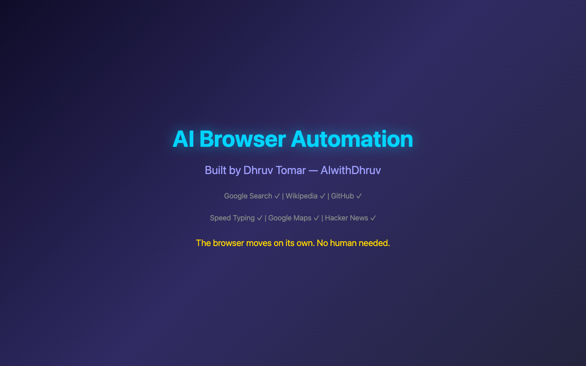
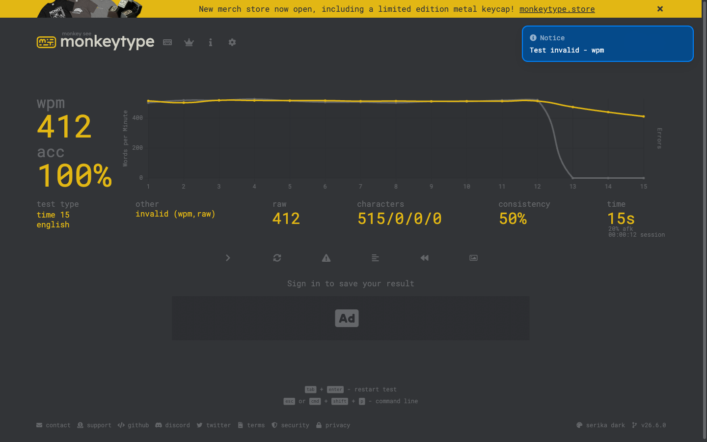
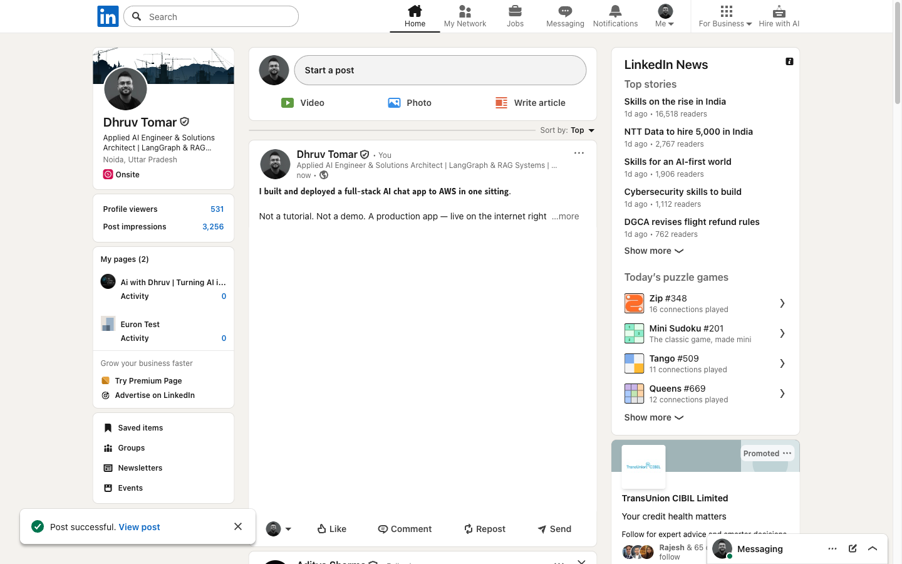
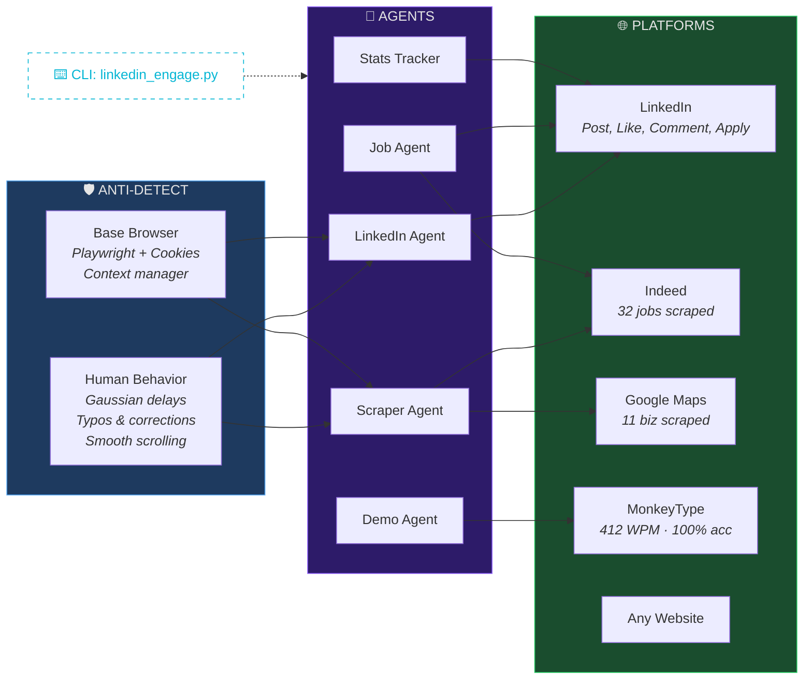

<div align="center">

# Ghost Browser

### The browser moves on its own. No human needed.


Your browser opens. Types by itself. Scrolls LinkedIn. Posts content. Applies to jobs.
Scrapes data from any website. Takes typing tests at **412 WPM**. All while you watch.

**Built in one session with Claude Code + Playwright.**

<br />



<br />

[View Demo](#the-wow-demo) · [Quick Start](#quick-start) · [All Commands](#all-commands) · [How It Works](#how-it-works)

</div>

---

## What It Does

| Capability | What Happens |
|:---|:---|
| **LinkedIn Auto-Post** | Opens LinkedIn, types your post letter-by-letter, attaches image, clicks Post |
| **LinkedIn Engagement** | Scrolls feed, likes posts, writes AI-generated comments in your voice |
| **Job Applications** | Searches jobs, reads descriptions, applies with AI-written cover letters |
| **Universal Web Scraper** | Scrapes ANY website — Indeed, Google Maps, Hacker News, anything |
| **Ghost Typing** | Takes typing tests at 400+ WPM with 100% accuracy |
| **Speed Reading** | Opens Wikipedia, scrolls and highlights key information live |
| **GitHub Trending** | Browses trending repos, opens top projects |
| **Stats Tracking** | Pulls followers/views from LinkedIn, Twitter, YouTube |
| **Screenshot Tool** | Screenshots any URL with custom viewports |

---

## The WOW Demo

```bash
python3 demo_wow.py
```

Watch the browser come alive — 6 stages, zero human input:

1. **Google Search** — ghost types "How to build AI agents" letter by letter
2. **Wikipedia** — speed-reads an AI article, highlights key paragraphs
3. **GitHub** — browses trending repos, clicks into the #1 project
4. **MonkeyType** — takes a typing test at ~400 WPM (world record is 300)
5. **Hacker News** — reads the top tech story
6. **Finale** — custom branded splash screen

**No one is touching the keyboard. The browser does everything.**

---

## Proof It Works

### MonkeyType — 412 WPM | 100% Accuracy

<div align="center">



</div>

> MonkeyType flagged it as **"Test invalid"** because no human can type this fast. The world record is ~300 WPM. Ghost Browser hit 412.

<br />

### LinkedIn — Auto-Posted With Image

<div align="center">



</div>

> Full post with image, typed and published automatically. "Post successful" confirmation at the bottom — completely hands-free.

---

## Quick Start

```bash
# Clone
git clone https://github.com/aiagentwithdhruv/ghost-browser.git
cd ghost-browser

# Install
pip install -r requirements.txt
playwright install chromium

# Set up credentials
cp .env.example .env
# Add your LinkedIn li_at cookie (see Credentials section)

# Run the demo
python3 demo_wow.py
```

**4 commands. Watch the magic.**

---

## All Commands

### LinkedIn Automation

```bash
# Post to LinkedIn with image
python3 linkedin_engage.py post --text "Your post here" --image photo.jpg --visible

# Post from a text file
python3 linkedin_engage.py post --text-file post.txt --image banner.png --visible

# Scroll feed and view posts
python3 linkedin_engage.py feed --visible

# Auto-engage: like + AI comment on 5 posts
python3 linkedin_engage.py engage --count 5 --visible

# Search + apply to jobs with AI cover letters
python3 linkedin_engage.py apply --query "AI engineer" --location "Remote" --visible

# Send connection requests with custom note
python3 linkedin_engage.py connect --profile "https://linkedin.com/in/someone" --note "Hey!" --visible
```

### Scrape Any Website

```bash
# Indeed jobs
python3 universal_scraper.py indeed --query "AI engineer" --output jobs.json

# Google Maps businesses
python3 universal_scraper.py google-maps --query "AI companies San Francisco" --output leads.json

# Any URL — smart mode auto-detects content
python3 universal_scraper.py "https://news.ycombinator.com" --mode smart --output hn.json

# Custom CSS selector
python3 universal_scraper.py "https://example.com" --selector "h2.title" --output titles.json
```

### Stats & Screenshots

```bash
# Pull stats from all platforms
python3 stats_tracker.py --notify

# YouTube only (free API, no browser needed)
python3 stats_tracker.py --youtube-only

# Screenshot any URL
python3 screenshot_tool.py --url "https://example.com" --output screenshot.png
```

### Fun Demos

```bash
# The full WOW demo (6 stages)
python3 demo_wow.py

# MonkeyType speed demon (15 sec test, ~400 WPM)
python3 monkeytype_flex.py

# Job market research (LinkedIn + Indeed)
python3 job_research.py
```

---

## How It Works

### Architecture

```
┌─────────────────────┐     ┌──────────────────┐     ┌─────────────────────────────┐
│   🛡️ ANTI-DETECT     │     │   🤖 AGENTS       │     │   🌐 PLATFORMS               │
│                     │     │                  │     │                             │
│  ┌───────────────┐  │     │  ┌────────────┐  │     │  ┌──────────┐              │
│  │Human Behavior │──┼────►│  │  LinkedIn   │──┼────►│  │ LinkedIn │ Post, Like   │
│  │               │  │     │  │  Agent      │  │     │  │          │ Comment,Apply│
│  │ gaussian delay│  │     │  └────────────┘  │     │  └──────────┘              │
│  │ typos+correct │  │     │  ┌────────────┐  │     │  ┌──────────┐              │
│  │ smooth scroll │  │     │  │  Scraper    │──┼────►│  │  Indeed  │ 32 jobs      │
│  └───────────────┘  │     │  │  Agent      │──┼──┐ │  └──────────┘              │
│                     │     │  └────────────┘  │  │ │  ┌──────────┐              │
│  ┌───────────────┐  │     │  ┌────────────┐  │  └►│  │Google Map│ 11 biz       │
│  │ Base Browser  │──┼────►│  │  Job Agent  │  │     │  └──────────┘              │
│  │               │  │     │  └────────────┘  │     │  ┌──────────┐              │
│  │ Playwright    │  │     │  ┌────────────┐  │     │  │MonkeyType│ 412 WPM      │
│  │ + Cookies     │  │     │  │ Demo Agent  │──┼────►│  │          │ 100% acc     │
│  └───────────────┘  │     │  └────────────┘  │     │  └──────────┘              │
│                     │     │  ┌────────────┐  │     │  ┌──────────┐              │
│                     │     │  │Stats Tracker│  │     │  │Any Website│             │
│                     │     │  └────────────┘  │     │  └──────────┘              │
└─────────────────────┘     └────────┬─────────┘     └─────────────────────────────┘
                                     │
                            ┌ ─ ─ ─ ─▼─ ─ ─ ─ ─ ┐
                              CLI: linkedin_engage.py
                            └ ─ ─ ─ ─ ─ ─ ─ ─ ─ ┘

              15 scripts │ 3000+ lines │ Built with Claude Code
```

<details>
<summary>Interactive diagram (click to expand)</summary>



</details>

**File hierarchy:**
```
human_behavior.py          ← Anti-detection: random delays, human typing, smooth scrolling
    ↓
base_browser.py            ← Playwright wrapper: cookie auth, navigation, screenshots
    ↓
├── linkedin_browser.py    ← LinkedIn: post, like, comment, apply, connect
├── linkedin_scraper.py    ← LinkedIn: followers, connections, post analytics
├── twitter_scraper.py     ← Twitter: followers, impressions
├── youtube_stats.py       ← YouTube API (no browser needed)
├── universal_scraper.py   ← Scrape ANY website with presets
└── screenshot_tool.py     ← Screenshot any URL
    ↓
├── linkedin_engage.py     ← CLI for all LinkedIn actions
├── stats_tracker.py       ← Master stats orchestrator
├── demo_wow.py            ← The viral demo
└── job_research.py        ← Job market research
```

### Human-Like Behavior Engine

The `human_behavior.py` layer makes every action indistinguishable from a real user:

| Behavior | Implementation |
|:---|:---|
| **Typing** | Character-by-character at 40-55 WPM with 3-5% typo rate — types wrong char, pauses, backspaces, corrects |
| **Delays** | Gaussian distribution (not uniform) — clusters around midpoint like real humans |
| **Scrolling** | Sinusoidal speed curve — slow start, fast middle, slow end |
| **Clicking** | Random offset from element center (bots click dead-center, humans don't) |
| **Reading** | Calculates reading time based on word count, waits proportionally |
| **Breaks** | 30-120 sec breaks every 15-25 actions |
| **Viewport** | Random realistic resolution from a pool (1440x900, 1920x1080, etc.) |

```python
# Ghost typing with realistic typos
HumanBehavior.human_type(page, "input", "Hello world", wpm=45, typo_rate=0.05)

# Smooth scrolling (sinusoidal, not instant jump)
HumanBehavior.human_scroll(page, "down", distance=600)

# Click with natural offset from center
HumanBehavior.human_click(page, "button.submit")

# Reading delay proportional to content length
HumanBehavior.reading_time("This is a long article about AI...")
```

### LinkedIn Post Flow

```
Open feed → Click "Start a post"
    → Find Quill editor (contenteditable div)
    → Short posts (<200 chars): ghost-type character-by-character with typos
    → Long posts (>200 chars): insert_text (humans paste long posts too)
    → Click media button → upload image via file input
    → Click "Next" (LinkedIn's image editor step)
    → Click "Post" → confirmed!
```

### AI-Generated Comments

```python
# Uses GPT-4o-mini with your brand voice
BRAND_PROMPT = """You are Dhruv Tomar (AIwithDhruv), an Applied AI Engineer.
Your tone: 40% witty realism, 30% strategic clarity, 20% motivational.
Write SHORT comments (1-3 sentences). Be genuine, add value.
Never be generic ("Great post!"). Sound like a real person."""
```

---

## Getting Credentials

<details>
<summary><b>LinkedIn <code>li_at</code> Cookie</b></summary>

1. Login to LinkedIn in Chrome
2. DevTools (F12) → Application → Cookies → `linkedin.com`
3. Copy `li_at` value → paste in `.env`

</details>

<details>
<summary><b>YouTube API Key (FREE)</b></summary>

1. [Google Cloud Console](https://console.cloud.google.com/apis/credentials) → Enable YouTube Data API v3
2. Create API Key → copy to `.env`
3. Cost: $0 (10,000 free units/day)

</details>

<details>
<summary><b>Twitter Cookies</b></summary>

1. Login to x.com → DevTools → Application → Cookies
2. Copy `auth_token` and `ct0` → paste in `.env`

</details>

---

## Project Structure

```
ghost-browser/
├── base_browser.py           Playwright base class (context manager)
├── human_behavior.py         Anti-detection engine
│
├── linkedin_browser.py       LinkedIn read + write operations
├── linkedin_engage.py        LinkedIn CLI (feed, post, engage, apply, connect)
├── linkedin_scraper.py       LinkedIn stats scraper
│
├── universal_scraper.py      Scrape any website (6 presets)
├── twitter_scraper.py        Twitter/X scraper
├── youtube_stats.py          YouTube API (no browser)
│
├── screenshot_tool.py        Universal screenshot tool
├── stats_tracker.py          Master stats + Telegram notifications
│
├── demo_wow.py               The viral demo (6 stages)
├── monkeytype_flex.py        Speed typing demo (400+ WPM)
├── job_research.py           Job market research
│
├── assets/                   Screenshots
├── requirements.txt          Dependencies
└── .env.example              Credential template
```

---

## Tech Stack

| Tool | Purpose |
|:---|:---|
| **Playwright** | Headless/visible Chrome automation |
| **Python 3** | Clean scripts, no heavy frameworks |
| **OpenAI GPT-4o** | AI-generated comments and cover letters |
| **YouTube Data API** | Free stats without browser overhead |

---

## Use Cases

| Use Case | How | Potential Revenue |
|:---|:---|:---|
| **LinkedIn Automation Service** | Auto-post, engage, grow profiles for clients | $500-2,000/mo per client |
| **Web Scraping Gigs** | Scrape leads, jobs, businesses on Fiverr/Upwork | $200-1,000 per project |
| **LinkedIn Ghostwriting** | AI-write + auto-post for founders/CEOs | $500-1,500/mo per client |
| **Job Application Bot** | Auto-apply to 100+ jobs for seekers | $50-200 per person |
| **Lead Generation** | Scrape Google Maps → enrich → cold email | $500-2,000/mo per client |

---

## Built With

Built in **one session** using [Claude Code](https://claude.ai/code) (Anthropic's AI coding agent) + Playwright.

15 files. 3,000+ lines of code. LinkedIn automation, web scraping, human behavior simulation, typing demos — designed, coded, tested, and deployed in a single sitting.

**No tutorials. No copy-paste. AI-generated architecture, human-verified execution.**

---

<div align="center">

### Built by [Dhruv Tomar](https://linkedin.com/in/aiwithdhruv) — @AIwithDhruv

Applied AI Engineer & Solutions Architect

Building AI systems that actually ship.

<br />

MIT License — use it, modify it, sell services with it.

<br />

**If the ghost browser blew your mind, drop a star.**

</div>
